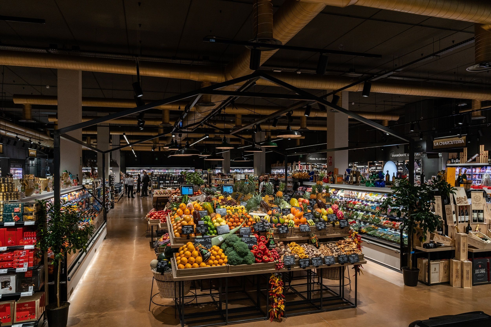

# Customer Segmentation Analysis
## Ironhack Data Analytics Bootcamp Final Project 

##### 

### **Project Overview**
#
For my final project of Ironhack Data Analytics Bootcamp I wanted to put myself in a real marketing case so I could see how to use all the knowledge gained during the bootcamp in a real business. 
  
This project shows a Customer Segmentation Analysis of a premium supermarket, with the aim of doing clusters of the clients' database to then target them with marketing campaigns in a proper way as well as launch innovations based on their profile and carry out promotions.
 
The data has been taken from a dataset in Kaggle called [Customer Personality Analysis](https://www.kaggle.com/imakash3011/customer-personality-analysis).

### **Process**
#
1. Data cleaning: eliminating unnecessary info and creating new key variables for the analysis.

2. Data pre-processing: preparing the data to do the unsupervised learning model with k-means, transforming the categorical data into ordinal using *One Hot Encoder* method. 

3. Unsupervised Learning: using the K-Means method to get the clusters.  

4. Analysis of the clusters: identifying how the algorithm has divided my clusters looking at the characteristics of each with the help of data visualization. 

5. Analysis of marketing campaigns: looking at the acceptance ratio of the 6 latest marketing campaigns by cluster, identifying opportunities by cluster. 

6. Loading the data into Tableau for visualization purposes. 

### **Conclusion & Learnings** 
#
The algorithm has divided my customers into 4 groups, based on their level of income and their loyalty level mainly: Super Client, Good Client, Potential Good Client & Casual Client. 

The most loyal clusters are *Super Client* and *Good Client*, the ones with the highest income and represent 43% of my total clients in total (22% and 21% respectively). 

Then, there is the *Potential Good Client* group, who is very promo driven and with a lower income than the 2 clusters above. 

Finally, *Casual Client* cluster is the biggest group as well as the less loyal client. The shop in the store occasionally and driven by promotions.

With this segmentation and the learnings per cluster, I have taken a look at the performance of the marketing campaigns by cluster, identifying that they are more effective in the *Super Client* than in the rest of the groups. 

My recommendation is for the company to perform more targeted campaigns for each clusters, with different purposes, stated below:
- *Super Client*: continue with the current campaigns with the purpose of maintain these clients in the business.
- *Good Client*: try to move them to the *Super Client* category to gain more revenue and volume. 
- *Potential Good Client*: same as above, engage with them more to move the to *Good Client* group, targeting them with promos.
- *Casual Client*: engage with them more with promos and online, as they are the ones who visit more the website in a monthly basis. 

### **Structure of project files**
#
This project contains:
- Notebooks folder: with 4 Jupyter Notebooks dedicated to 1) cleaning the dataset; 2) data pre-processing; 3) Clustering with K-Means; 4) Marketing Campaigns Analysis
- Data folder: with all the data used for the project
- Tableau Story: with the summary of the project and the presentation deck, it can be found [here](https://public.tableau.com/app/profile/mar.a.p.rez.de.ayala/viz/FinalProject-Presentation_16396524682090/Final)

### **Tools & Techniques**
#
- Python (Pandas, Numpy)
- Data Visualization (Plotly, Seaborn, Matplotlib)
- Machine Learning (K-Means)
- Tableau

### **Libraries**
#
[pandas](https://pypi.org/project/pandas/)

[numpy](https://numpy.org/)

[seaborn](https://seaborn.pydata.org/)

[plotly express](https://plotly.com/python-api-reference/plotly.express.html)

[scikit-learn](https://scikit-learn.org/stable/)

